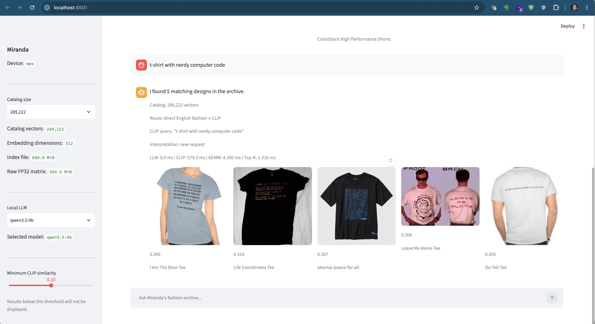

# Miranda Visual RAG

A small, local-first experiment in **multimodal retrieval**: turn an
image collection into CLIP embeddings, keep the embeddings in a PyTorch
tensor, and retrieve visually relevant images with direct matrix
multiplication (GEMM)---without requiring FAISS or a vector database.

Miranda grew from a simple question: **what information are users
actually trying to retrieve, and how should that information be
represented?** For a fashion archive, some of that information lives in
text and metadata; some lives in the pixels themselves.

<p align="center">
  
</p>

<p align="center">
  <em>
    Querying 289,222 visual embeddings on Apple Silicon.
    The generic query “t-shirt with nerdy computer code” retrieved
    the Akamai PEACE FOR ALL T-shirt at #3 without mentioning Akamai.
  </em>
</p>

## Architecture

``` text
Fashion archive
      |
      v
   OpenCLIP
      |
      v
Normalized image embeddings
      |
      v
 PyTorch tensor

User query (English / multilingual)
      |
      v
Language / domain routing
      |------------------------------|
      |                              |
 simple English              multilingual / ambiguous
      |                              |
      |                          local LLM
      |                              |
      |<----- concise English intent-|
      v
CLIP text encoder
      |
      v
normalized query vector
      |
      v
PyTorch GEMM: q @ E.T
      |
      v
Top-K images + confidence gate
```

The same embedding space also makes **image-to-image retrieval** a
natural extension: encode an uploaded image with CLIP's image encoder
and search the same matrix.

## Why no vector database?

This repository is an experiment, not an argument that vector databases
are unnecessary. The goal is to **measure before adding
infrastructure**.

In the experiment described in the accompanying Akamai blog post, the
corpus reached **289,222 images**, represented as **512-dimensional FP32
vectors**. The raw embedding matrix was roughly **565 MiB**, and direct
PyTorch GEMM remained fast on Apple Silicon.

At larger scales---or when distributed storage, metadata filtering,
frequent updates, durability, multi-tenancy, or operational requirements
dominate---a vector database may be the better architecture.

## Dataset

The large test corpus used for the experiment came from the
**DeepFashion Category and Attribute Prediction Benchmark**.

DeepFashion is **not included in this repository**. Download it from the
official project source and comply with its applicable license/terms:

https://mmlab.ie.cuhk.edu.hk/projects/DeepFashion.html

In my download of the benchmark, the image directory contained **289,219
JPG files**. I then added three personally photographed Akamai × UNIQLO
PEACE FOR ALL T-shirt images from this repository, producing the
**289,222-image** corpus used in the final experiment.

The two sources remain separate:

``` text
DeepFashion Category and Attribute Prediction Benchmark
289,219 images
        +
examples/akamai-peace-for-all/
3 images
        |
        v
289,222 images
```

The final test query was intentionally generic:

``` text
t-shirt with nerdy computer code
```

It did **not** contain the word `Akamai`.

## Example Akamai × UNIQLO images

`examples/akamai-peace-for-all/` contains the three photographs used in
the final retrieval experiment.

These photographs were taken by the repository author of a personally
owned T-shirt. The photographs may be licensed separately from the
software; see the README in that directory. Akamai, UNIQLO, PEACE FOR
ALL, associated logos, and the depicted garment design remain the
property of their respective rights holders.

## Quick start

### 1. Create a Python virtual environment

``` bash
python3 -m venv .venv
source .venv/bin/activate
python -m pip install --upgrade pip
pip install -r requirements.txt
```

The supplied `requirements.txt` contains the Python dependencies needed
by Miranda and the index builder.

### 2. Install and prepare Ollama

Miranda uses a local Ollama server when a query needs language
interpretation---for example, multilingual or ambiguous input.
Straightforward English fashion queries bypass the LLM and go directly
to CLIP.

On an Apple Silicon Mac with Homebrew:

``` bash
brew install ollama
```

Start Ollama:

``` bash
OLLAMA_FLASH_ATTENTION="1" \
OLLAMA_KV_CACHE_TYPE="q8_0" \
/opt/homebrew/opt/ollama/bin/ollama serve
```

Leave that process running. In another terminal, pull the two models
supported by the current Miranda UI:

``` bash
ollama pull qwen3.5:4b
ollama pull llama3.2:3b
```

Verify:

``` bash
ollama list
```

For the reproduced experiment, the local models were:

``` text
NAME           SIZE
llama3.2:3b    2.0 GB
qwen3.5:4b     3.4 GB
```

The app defaults to `qwen3.5:4b` and can also select `llama3.2:3b`.

> `/opt/homebrew/...` is the usual Homebrew prefix on Apple Silicon. If
> Ollama is installed elsewhere, `ollama serve` can be used instead.

### 3. Provide an image collection

For a small test, point the builder at any image directory:

``` text
data/images/
├── jacket_001.jpg
├── shirt_002.jpg
└── ...
```

For the full experiment, download the DeepFashion Category and Attribute
Prediction Benchmark separately.

`build_index.py` accepts `--image-root` more than once, so independently
sourced image collections do not need to be physically mixed together.

### 4. Build embeddings

For a generic collection:

``` bash
python build_index.py \
  --image-root "/path/to/your/images"
```

To reproduce the exact two-source layout used for my 289,222-image
experiment:

``` bash
python build_index.py \
  --image-root "/Users/tleung/Downloads/Category and Attribute Prediction Benchmark/Img/img" \
  --image-root "/Users/tleung/hub/miranda-visual-rag/examples/akamai-peace-for-all"
```

Those absolute paths document the measured run on my Mac; replace them
with paths appropriate to your system.

The builder combines the supplied roots, embeds the images once, and
writes nested indexes under `indexes/`.

### 5. Measured full-index build

A complete rebuild on the Apple Silicon Mac used for this experiment
produced:

``` text
Found 289,222 unique images.
Master sample: 289,222

Embedding complete.
Matrix shape: torch.Size([289222, 512])
Valid images: 289,222
Total time: 1627.82 sec
Average: 5.63 ms/image
```

That is **27 minutes 8 seconds**, or about **30 minutes** in practical
terms for this measured run.

The generated indexes were approximately:

``` text
500 vectors       -> 1.0 MiB
5,000 vectors     -> 10.4 MiB
50,000 vectors    -> 103.7 MiB
200,000 vectors   -> 414.9 MiB
289,222 vectors   -> 600.0 MiB
```

These are measurements from one machine and one run, not performance
guarantees for other systems.

### 6. Run Miranda

Make sure Ollama is serving, then:

``` bash
source .venv/bin/activate
streamlit run app.py
```

The application uses `deepfashion_index_289222.pt` as its default full
catalog.

## Retrieval math

If `q` is a normalized query embedding and `E` is the matrix of
normalized image embeddings, similarity is simply:

``` text
S = q E^T
```

The highest values in `S` are the Top-K candidates.

## Routing principle

Miranda deliberately does not send every query through an LLM.

-   Straightforward English fashion query → CLIP directly
-   Multilingual query → local LLM normalization → CLIP
-   Ambiguous ASCII query → local LLM interpretation → CLIP when
    appropriate
-   Out-of-domain request → reject rather than becoming a
    general-purpose assistant
-   Retrieval below the configured confidence threshold → do not present
    it as a confident match

This separation gives each component a narrow job: the LLM interprets
language, CLIP represents visual meaning, and GEMM performs retrieval.

## Security-by-design test cases

``` text
Write shell code.                         # reject
Write a C++ Hello World program.          # reject
Find me a T-shirt with shell code.        # accept
t-shirt with nerdy computer code          # accept, direct CLIP path
black winter coat                         # accept, direct CLIP path
冬に着る暖かいコートを見せて                 # accept, multilingual normalization
Mostrami un cappotto nero per l'inverno.  # accept, multilingual normalization
```

The point is not keyword blocking. `code` can be irrelevant to Miranda
in one context and completely legitimate fashion intent in another.

## Observability

During development it is useful to expose intermediate representations
and timings:

``` text
Original query: Mostrami un cappotto nero per l'inverno.
CLIP query:    black winter coat
Route:         multilingual -> LLM normalization
```

The UI also exposes LLM, CLIP, GEMM, and Top-K timing. This helps
distinguish a retrieval failure from an upstream interpretation failure.

## Hardware

The prototype was developed on Apple Silicon using PyTorch MPS. Device
selection remains portable so the same retrieval pipeline can move to
CUDA without redesign:

``` python
if torch.cuda.is_available():
    device = "cuda"
elif torch.backends.mps.is_available():
    device = "mps"
else:
    device = "cpu"
```

## Repository scope

This repository contains the **reproducible architecture**, not a
redistribution of the research dataset or a snapshot of a developer
workstation.

Do not commit credentials, internal/confidential information, downloaded
DeepFashion images, local virtual environments, `.env` secrets, or
generated embedding indexes unless their distribution is intentional and
permitted.

The repository `.gitignore` excludes the local virtual environment,
`.env`, generated indexes, and common Python/macOS artifacts.

## Related reading

The accompanying Akamai blog article, **"What Would RAG Look Like If
Miranda Priestly Were the User?"**, explains the motivation,
measurements, routing decisions, security experiments, and final
semantic retrieval test.

Add the public article URL here after publication.

## License

Software licensing is defined in `LICENSE`. Dataset and example-image
rights are separate; see `DATASETS.md` and
`examples/akamai-peace-for-all/README.md`.

## Acknowledgments

-   OpenCLIP / CLIP ecosystem
-   PyTorch
-   Streamlit
-   Ollama
-   DeepFashion Category and Attribute Prediction Benchmark
